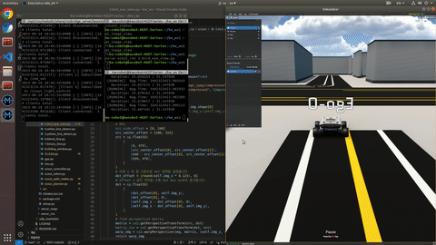
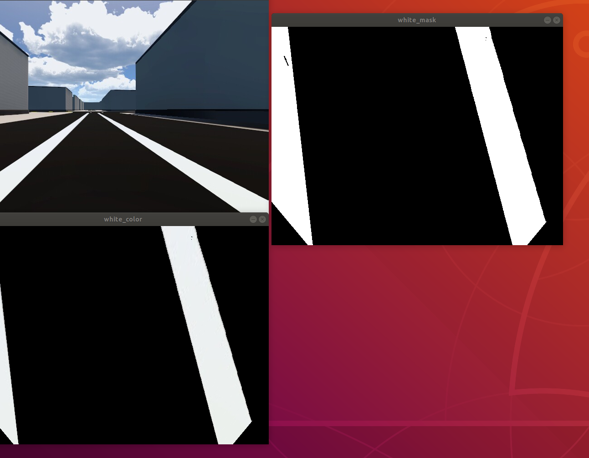
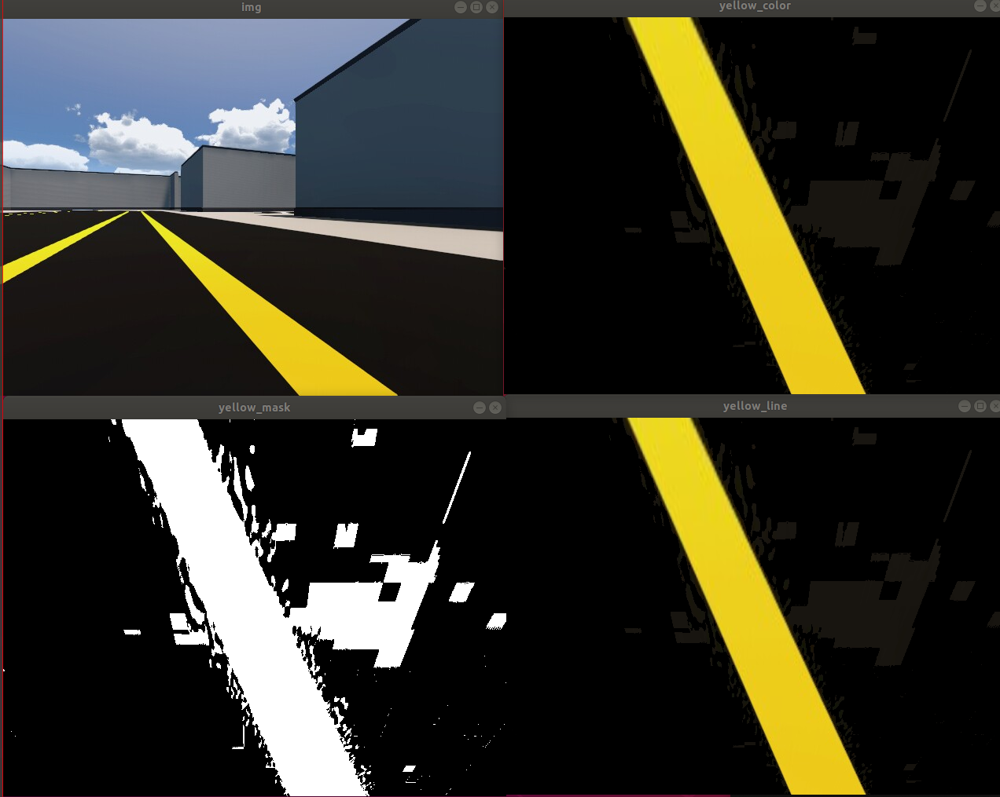
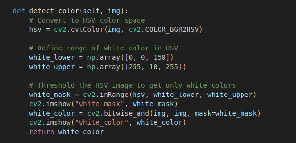
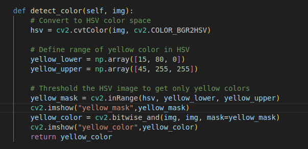

# Scout Camera Simulation

### 목표 
- MORAI Simulation 환경에서 Scout_mini에 카메라를 달아서 Line_Detect 후 선 안에서 자율주행을 한다.
---

### 중요 기술 
    1. Bird Eye Transformation
    2. White and Yellow Line Sepertaion
    3. Image Blend and Binary Line
    4. Sliding Window to help following Line
    5. Line Keeping Assit System Algorithm

### 들어가기전 RosBag
- rosbag은 ros의 모든 토픽과 데이터를 저장해서 프로그램을 실행시키지 않아도 데이터를 송신해서 실제 현장 실험의 횟수를 줄일수 있는 도구
- rosbag record -a 를 하면 데이터를 저장
- rosbag play <플레이하고싶은 파일> 를 하면 저장된 데이터가 실행된다
- play했을때 보고싶은 데이터는 rostopic 이나 rviz, rqt를 사용하면 됨

### Bird Eye
- 카메라는 전면을 봐서 차선을 온전히 인식하지 못함
- 그렇기에 차선을 위-> 아래로 보도록 이미지를 수정해야 라인 인식이 쉬움
- 일정 영역을 Projection 시켜서 차선을 수직으로 볼수 있게 해야함

---

### Yellow & White Detect
- 차선을 따라가게 주행하려면 주행할 수 있는 영역과 경계선을 파악해야함
- OpenCv2의 내부 메소드 rgbtohsv로 채도(hue)값을 이용해서 영역을 설정
- 원하는 색깔의 영역을 bitand 연산해서 목표색이 있는 부분만 남김

    
    
    <figcaption align="center">White And Yellow Line</figcaption>

    
    
    <figcaption align="center">White And Yellow Code</figcaption>

### Blend & Binary Calculation
- 차선 두개를 인식한 뒤 이것을 Line Following에 적용 시키기 위해서 인식한 두개의 선을 한 화면에 합치기
- 차선 주행을 원활하게 하기 위해서 차선을 0,1로 이진화 시킨다
    - 차선(노란색 또는 하얀색) = 1(흰색)
    - 다른곳 = 0(검정)

### Sliding Window
- 차선이 어떻게 변화하는지에 따라 로봇의 회전을 제어해야하므로 차선의 선의 방향 및 모양을 분석하기위해서 Window를 여러 개 만들어서 선의 모양을 분석한다.
- 선은 빨간선과 녹색선으로 표시(좌 : 빨강, 우: 초록)
- 선의 좌표를 일정한 간격으로 추출 한뒤 OpenCv의 내부메소드 Rectangle로 선을 중심으로 일정한 간격의 윈도우를 생성

### LKAS 
- Sliding Window를 통해서 선이 어떻게 변화하고 있는지 확인했고, 변화량에 따라 회전 량을 조절한다.
- 우측 통행을 기준으로 왼쪽 차선은 노란색이므로 노란선을 벗어나지 않는 주행방법(좌측 선 기준 Following)을 선정하였다.
- 위에서 5개의 윈도우의 중심 기준으로 선이 왼쪽에 많이 가있으면 왼쪽으로 가중치를 주어 최종적으로 계산해서 왼쪽으로 회전하게 하는 제어 방식  

